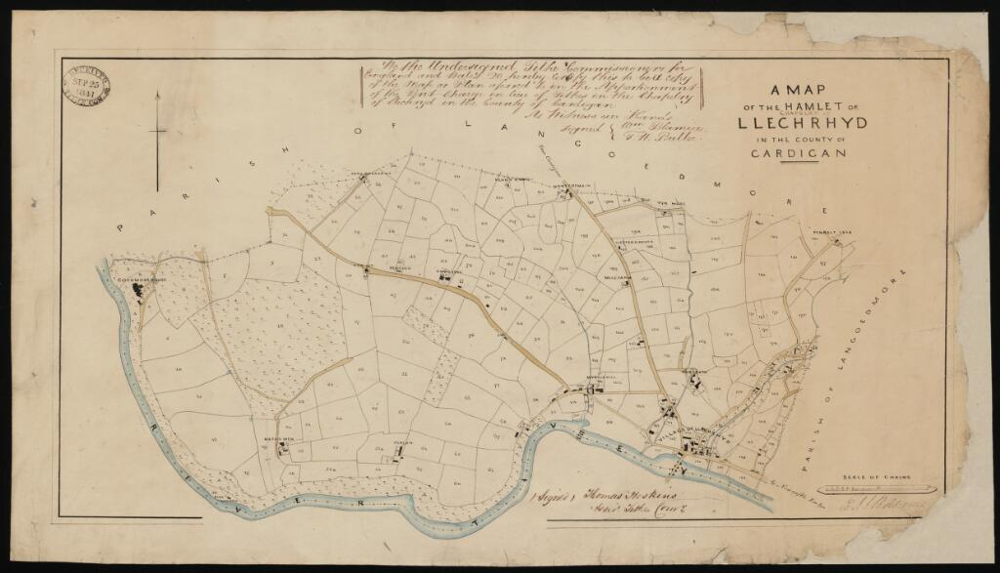
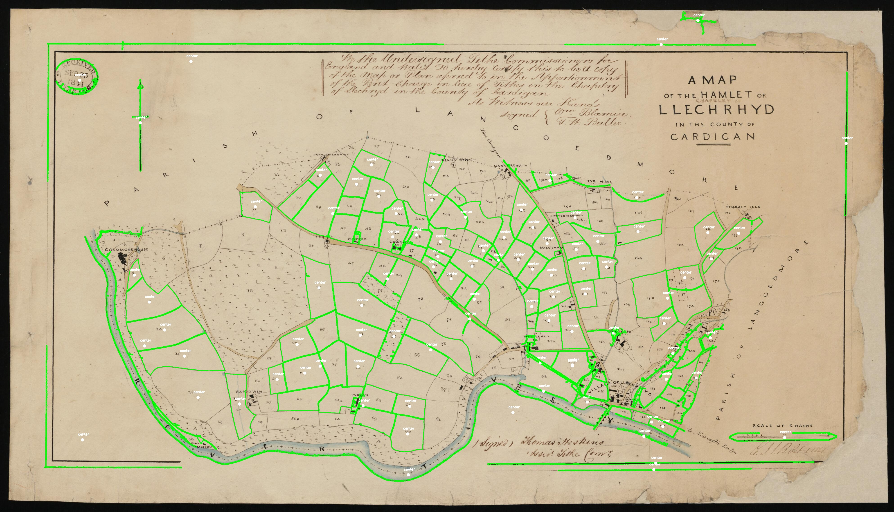
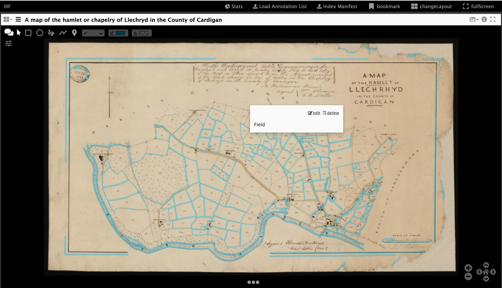

[](https://travis-ci.com/glenrobson/map_contours)

# Map Contours
This code was developed for the National Library of Wales hackathon in February 2020 and aims to create vector shapes for each field in a Cynefin Tithe Map. 

Details on Tithe Maps and how the data was captured can be seen on the [Cynefin pages](https://www.library.wales/digitisation-projects/places-of-wales/about-places-of-wales). To search the Tithe Map data please see [https://places.library.wales](https://places.library.wales/) 

For the purposes of this project you can see an example of a Tithe Map below:



and I would like to create an outline for each field. The Cynefin data holds the coordinates of the mid point of a field (the number seen in each field in the above image) and related data in Apportionment records which show who Owned, Rented a field and what it was used for e.g. Forest, bog, wheat etc. If I could combine the mid point data with an actual shape I could highlight the fields on the map to show who owned large areas of Wales during the Tithe map period.  

Inspired by work done at [Stanford](http://bit.ly/histonets-iiif) I have tried using Contour detection to see if it will pick out fields. Contour detection is defined as:

["Contours can be explained simply as a curve joining all the continuous points (along the boundary), having same color or intensity. The contours are a useful tool for shape analysis and object detection and recognition."](https://docs.opencv.org/3.4/d4/d73/tutorial_py_contours_begin.html)

and the results for the few Maps I've tried while not perfect give a start:



The `contors.py` file can generate the above image but can also convert the shapes found into IIIF Annotations. Once you have Annotations it is possible to load these into an Annotation store and use IIIF clients like Mirador to add, delete or edit regions and could in theory form the basis of a crowdsourcing project to correct the machine identification of field boundaries. 

One Annotation store that you can load and edit the generated Annotations is the [SimpleAnnotationStore](https://github.com/glenrobson/SimpleAnnotationServer) and instructions for loading a Annotation list can be seen [here](https://github.com/glenrobson/SimpleAnnotationServer/blob/master/doc/PopulatingAnnotations.md). Another option is to link Read Only annotations to the source Cynefin map and view these in Mirador. Instructions on how to do this can be seen in Step 4 of the [DHSI IIIF workshop](https://iiif.github.io/training/iiif-5-day-workshop/day-three/annotation-store-download.html).

Once loaded into Mirador you should see the following:



# Usage:
**Note this code is only tested with Python 3**

Before running the `contour.py` script install the dependencies using:

```pip install -r requirements.txt```

The `contour.py` script takes at a minimum the input IIIF image and IIIF Manifest which contains this IIIF image:

 * `-i or --image` IIIF image ID e.g. `http://dams.llgc.org.uk/iiif/2.0/image/4576950`
 * `-m or --manifest` Manifest which contains the above image e.g. http://dams.llgc.org.uk/iiif/2.0/4576949/manifest.json

Other options include:

 * `-d or --demo` Show image segmentation, useful for demos. Press space to cycle through
 * `-o or --output` Filename for generated AnnotationList, default is annotations.json
 * `-e or --example` Filename for example image showing areas found, default is demo.jpg

The following flags may need playing with to get the best shape results from your image: 

 * `-min` Minimum threshold for area of shape between 0 and 1. This is a percentage of the entire image and the default is 0.001. Make this too large and you will only get big shapes. Make this too small and you will get shapes that are very small in the results. 
 * `-max` Maximum threshold for area of shape between 0 and 1. This is a percentage of the entire image and the default is 0.4 (i.e. 40%). Set this too small and you won't get many shapes. Set this to big and your likely to get shapes which aren't what your looking for e.g. the entire image. 
 * `-s or --size` Size of IIIF image to download. Use IIIF size syntax e.g. `2000,` or `pct:50`. If the source image is too small then shapes won't be detected. Large images will take longer to process. 

# Examples

NLW Cynefin map project example for [Llechryd](https://en.wikipedia.org/wiki/Llechryd) an area in Wales - [Original Map](https://viewer.library.wales/4576949):
```
python3 contour.py -i http://dams.llgc.org.uk/iiif/2.0/image/4576950 -m http://dams.llgc.org.uk/iiif/2.0/4576949/manifest.json
```

and to show this works with a non Cynefin images. An example from Stanford: [Stanford Heights](https://searchworks.stanford.edu/view/mk098gw2229)
```
python3 contour.py -i https://stacks.stanford.edu/image/iiif/mk098gw2229%2Fmk098gw2229_00_0001 -m https://purl.stanford.edu/mk098gw2229/iiif/manifest
```


